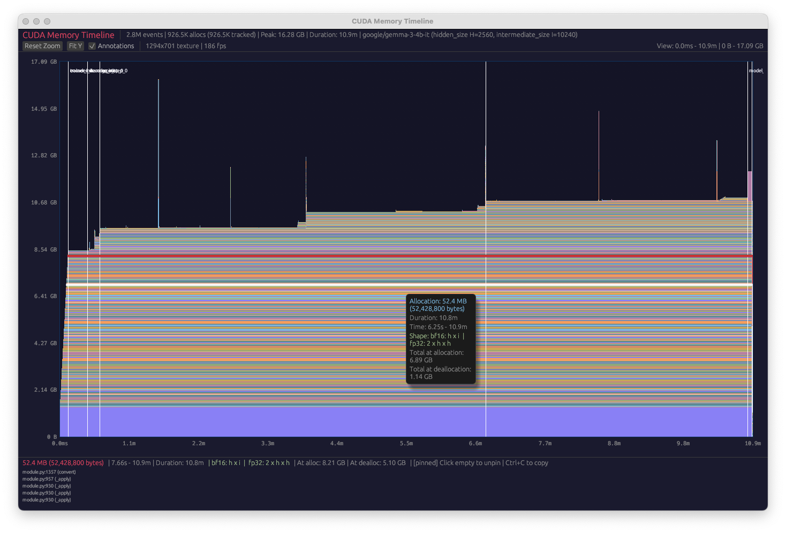

# desktop-memory-viz

Native GPU-accelerated CUDA memory timeline visualizer. Replaces PyTorch's
browser-based visualizer at https://pytorch.org/memory_viz which crashes on
large (~1 GB+) snapshot files.

Renders the "Active Memory Timeline" view: allocations shown as stacked
polygons where freeing a lower allocation causes everything above to slide
down. Handles 900K+ allocations at interactive framerates via texture-based
rasterization.



## Building

```bash
cargo build --release
```

## Usage

```bash
# From a pickle file (auto-calls Python to extract JSON, caches result)
./target/release/desktop-memory-viz snapshot.pickle

# From pre-extracted JSON (skips Python step)
python3 extract_snapshot.py snapshot.pickle snapshot.extracted.json
./target/release/desktop-memory-viz snapshot.extracted.json

# Track all allocations individually (default: top 1,000,000 by size)
./target/release/desktop-memory-viz snapshot.pickle --max-entries 10000000

# Fetch model config from HuggingFace for tensor shape display
./target/release/desktop-memory-viz snapshot.pickle --model google/gemma-3-4b-it

# Also show 4-bit and int8 factorizations (for quantized models)
./target/release/desktop-memory-viz snapshot.pickle --model google/gemma-3-4b-it --quantized

# Override vocab size (e.g., when using added tokens)
./target/release/desktop-memory-viz snapshot.pickle --model google/gemma-3-27b-it --vocab-size 262200

# Show GPU memory capacity line
./target/release/desktop-memory-viz snapshot.pickle --gpu h100

# Load gzip-compressed pickle files directly
./target/release/desktop-memory-viz snapshot.pickle.gz

# Filter annotations to a specific pattern
./target/release/desktop-memory-viz snapshot.pickle --annotation-filter "grpo"

# Show all annotations including PyTorch internals
./target/release/desktop-memory-viz snapshot.pickle --all-annotations
```

## Controls

| Action | Effect |
|--------|--------|
| Scroll | Zoom X axis (centered on cursor) |
| Shift+Scroll | Zoom Y axis |
| Drag | Pan |
| Cmd+Drag | Select horizontal region to zoom into |
| Double-click | Fit Y axis to data |
| Hover | Tooltip with allocation size, duration, tensor shape |
| Click | Pin allocation to bottom bar (persists while navigating) |
| Click empty space | Unpin |
| Right-click | Dismiss tooltip (keeps highlight outline) |
| Cmd+C (macOS) / Ctrl+C | Copy stack trace of pinned/hovered allocation |

## Features

- **Stacked area chart** matching PyTorch's Active Memory Timeline view
- **Texture rasterization** — renders 900K+ polygons as a single GPU texture,
  with O(1) hover detection via a pixel-indexed lookup map
- **Cmd+drag region selection** — select a horizontal time range to zoom into
- **Click-to-pin** — click an allocation to pin its details to the bottom bar;
  the bottom bar shows hover info by default and pinned info after clicking.
  Pinned allocations get a red outline, hovered allocations get a white outline
- **Bottom bar** — fixed panel with allocation details, stack trace (scrollable),
  tensor shape factorizations, and total memory at allocation/deallocation
- **Tensor shape display** (`--model`) — fetches `config.json` from HuggingFace
  (supports gated models via `~/.cache/huggingface/token` or `$HF_TOKEN`) and
  shows tensor sizes as factorizations of `hidden_size` (h), `intermediate_size`
  (i), and `vocab_size` (v) across dtypes (bf16, fp32; also 4-bit, int8 with
  `--quantized`). Use `--vocab-size` to override when using added tokens
- **GPU memory capacity line** (`--gpu`) — draws a dim red horizontal line at the
  GPU's max memory. Supports H100, A100, H200, A10G, L40S, V100, RTX 4090
- **Annotation context** — tooltips and the bottom mode line show the most recent
  annotation at the current time position
- **Annotation filtering** — auto-hides PyTorch dynamo/inductor internal
  annotations (CompiledFxGraph, pad_mm_benchmark, etc.), showing only
  user-defined markers by default
- **Gzip support** — loads `.pickle.gz` files directly
- **JSON caching** — pickle-to-JSON conversion is cached; subsequent runs skip
  Python extraction if the JSON is newer than the pickle

## Capturing a memory snapshot

Add the following to your training script to record a CUDA memory snapshot:

```python
import torch

# Start recording BEFORE any GPU operations (model loading, optimizer init, etc.)
torch.cuda.memory._record_memory_history(
    stacks="python",                # capture Python stack traces
    global_record_annotations=True, # capture user annotations (## markers ##)
)

# ... your training code here ...
# Annotate phases of training so they show up as labeled vertical lines.

# Stand-alone annotation: marks a single point in time.
torch.cuda.memory.record_annotation("## checkpoint_saved ##")

# Context manager: draws a start line and a matching end line,
# so you can see exactly how long a phase lasted.
with torch.cuda.memory.record_annotation("## forward_pass ##"):
    output = model(input_ids)
with torch.cuda.memory.record_annotation("## backward ##"):
    loss.backward()

# Save the snapshot after training (or at OOM, in a signal handler, etc.)
torch.cuda.memory._dump_snapshot("memory_snapshot.pickle")
torch.cuda.memory._record_memory_history(enabled=None)  # stop recording
```

Recommendations:

- **Start recording early** — call `_record_memory_history()` before creating
  models, optimizers, or any CUDA tensors so the snapshot captures the full
  timeline from the start.
- **Consider `expandable_segments`** — set `PYTORCH_CUDA_ALLOC_CONF=expandable_segments:True`
  to reduce fragmentation and make the timeline easier to read. Note this may
  have a small performance hit.
- **Add annotations** — wrap training phases with `## name ##` annotations so
  they show up as labeled vertical lines in the visualizer.
- **Free memory before saving** — delete models and call `torch.cuda.empty_cache()`
  before dumping so the trace shows memory returning to zero, which helps verify
  there are no leaks.

## Performance

On a 490 MB pickle (Gemma 4B, 2.7M events, 926K allocations):

| Step | Time |
|------|------|
| JSON parse (cached) | 0.2s |
| Polygon layout | 0.8s |
| **Total startup** | **~1.0s** |

## Requirements

- Rust (for building)
- Python 3 with `torch` (for pickle extraction; only needed when passing
  `.pickle` files directly)
